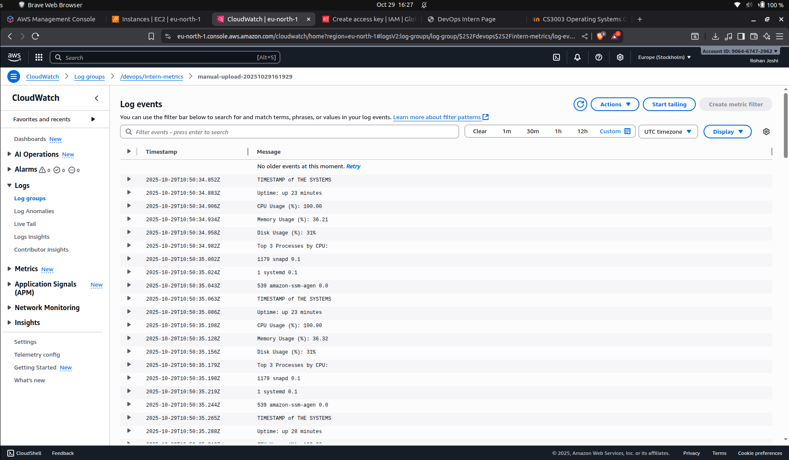

# DevOps Intern Assignment - Powerplay

---

## How to Clone

You can view, test, or reproduce the complete setup locally or in your own AWS environment.

### 🪜 1. Clone the Repository
```bash
git clone https://github.com/rohanjoshi15/Powerplay-DevopsInternAssignment.git
cd Powerplay-DevopsInternAssignment
```
---

## Part 1: EC2 Setup and User Configuration

### Steps:
1. **Launch an EC2 Instance**
   - I created a free-tier Ubuntu EC2 instance (t3.micro type) from the AWS Management Console.
   - This forms the base Linux server on
   - Type: `t3.micro` (Free Tier, since t2.micro is deprecated)
   - OS: `Ubuntu 22.04`
   - Key Pair: `devopsintern.pem` (RSA)

3. **Connect via SSH**
   - This allowed remote command-line access to the virtual machine hosted on AWS.
     
   ```bash
   ssh -i /path/to/devopsintern.pem ubuntu@<EC2_PUBLIC_IP>
   ```

5. **Create a new user**
   - This represents a new user
   - This is a common practice to separate user privileges and track access.
     
   ```bash
   sudo adduser devops_intern
   ```

7. **Grant sudo access without password**
   - This ensures that the user can execute administrative commands without repeatedly entering passwords
     
   ```bash
   echo "devops_intern ALL=(ALL) NOPASSWD:ALL" | sudo tee /etc/sudoers.d/devops_intern
   ```

9. **Change hostname**
    - The hostname personalization helps identify which environment or user is managing the instance.
    - This is needed in large teams.
   ```bash
   sudo hostnamectl set-hostname rohan-devops
   ```

11. **Verify changes**
   ```bash
   hostname
   ```

### Screenshots

- SSH into the EC2 instance with the key pair .


---

- Adding new user .


---

- Changing the hostname


---

## Part 2: Web Server Setup (Nginx)

### Steps:
1. **Install Nginx**
   - Nginx was used as a lightweight and fast web server to serve a simple HTML page.
   ```bash
   sudo apt update -y
   sudo apt install nginx -y
   ```

3. **Create HTML page**
   - The HTML displays:
   - My name
   - The EC2 instance ID (fetched from AWS metadata)
   - The ec2 command fetches the EC2 instance’s unique identifier (Instance ID) from AWS’s Instance Metadata Service (IMDS) and stores it in a shell variable named INSTANCE_ID.
   - CURL... just returns just the instance ID text string. ( the meta data has alot of items other than just instanceID)
   - The system uptime
     
   ```bash
   sudo tee /usr/local/bin/generate_index.sh > /dev/null <<'SH'
   #!/usr/bin/env bash
   NAME="ROHAN JOSHI"
   TOKEN=$(curl -s -X PUT "http://169.254.169.254/latest/api/token" -H "X-aws-ec2-metadata-token-ttl-seconds: 21600" || true)
   if [ -n "$TOKEN" ]; then
     INSTANCE_ID=$(curl -s -H "X-aws-ec2-metadata-token: $TOKEN" http://169.254.169.254/latest/meta-data/instance-id)
   else
     INSTANCE_ID=$(curl -s http://169.254.169.254/latest/meta-data/instance-id)
   fi
   UPTIME=$(uptime -p)
   cat <<HTML | sudo tee /var/www/html/index.html >/dev/null
   <!doctype html>
   <html>
     <head><meta charset="utf-8"><title>DevOps Intern Page</title></head>
     <body style="font-family: Arial, sans-serif; margin: 2rem;">
       <h1>$NAME</h1>
       <p><strong>Instance ID:</strong> $INSTANCE_ID</p>
       <p><strong>Server Uptime:</strong> $UPTIME</p>
     </body>
   </html>
   HTML
   SH
   ```

5. **Make script executable and run**
   ```bash
   sudo chmod +x /usr/local/bin/generate_index.sh
   sudo /usr/local/bin/generate_index.sh
   ```

6. **Access webpage**
   - Open: `http://<EC2_PUBLIC_IP>`

### Screenshots

- Checking if page exists before opening the ip


---

- Page (very basic HTML code)


---


## Part 3: Monitoring Script and Cron Job

### Script: `/usr/local/bin/system_report.sh`
- The script /usr/local/bin/system_report.sh collects key system metrics:
- Current timestamp
- Uptime
- CPU, memory, and disk usage
- Top 3 processes consuming the most CPU
- The script appends results to /var/log/system_report.log every time it runs.

```bash
#!/usr/bin/env bash
LOGFILE="/var/log/system_report.log"
TIMESTAMP=$(date '+%Y-%m-%d %H:%M:%S %z')
UPTIME=$(uptime -p)
CPU_IDLE=$(top -bn1 | awk -F'id,' -v RS=',' '/Cpu\(s\)/{print $1}' | awk '{print $NF}')
CPU_USAGE=$(awk -v idle="$CPU_IDLE" 'BEGIN{printf("%.2f",100-idle)}')
MEM_TOTAL=$(free -m | awk '/^Mem:/ {print $2}')
MEM_USED=$(free -m | awk '/^Mem:/ {print $3}')
MEM_PERC=$(awk -v u=$MEM_USED -v t=$MEM_TOTAL 'BEGIN{printf("%.2f",(u/t)*100)}')
DISK_PERC=$(df -h / | awk 'NR==2 {print $5}')
TOP3=$(ps -eo pid,comm,%cpu --sort=-%cpu | head -n 4 | tail -n 3)

{
  echo "$TIMESTAMP"
  echo "Uptime: $UPTIME"
  echo "CPU Usage (%): $CPU_USAGE"
  echo "Memory Usage (%): $MEM_PERC"
  echo "Disk Usage (%): $DISK_PERC"
  echo "Top 3 Processes by CPU:"
  echo "$TOP3"
  echo ""
} >> "$LOGFILE"
```

### Cron Job: `/etc/cron.d/system_report`
- Cron is a built-in Linux scheduler that automates repetitive tasks like logging, backups, or monitoring.
- the STARS represent minutes,hours,days, months, every day of the week (0-6)
- so here we do */5 because we want only after each 5 minutes.
- cron is basically used to trigger .sh or any other such files.
  
```bash
*/5 * * * * root /usr/local/bin/system_report.sh
```
- 

### Commands Used
```bash
sudo chmod +x /usr/local/bin/system_report.sh
sudo nano /etc/cron.d/system_report
sudo service cron start
sudo tail -n 20 /var/log/system_report.log
```

### Screenshots

- Screenshot of the LOG


---

## Part 4: AWS CloudWatch Integration

### IAM Role
- Created IAM Role: `devopsInternCWRole`
- Attached policy: `CloudWatchLogsFullAccess`
- Attached role to EC2 instance

### Commands Used
- This log group acts as a centralized storage for log data collected from my EC2 instance.
- 
```bash
aws logs create-log-group --log-group-name /devops/intern-metrics --region eu-north-1
aws logs create-log-stream --log-group-name /devops/intern-metrics --log-stream-name manual-upload-20251029161316 --region eu-north-1
```

### Upload Logs to CloudWatch
- Using the AWS CLI, I converted log lines into JSON format and pushed them to the log stream using:
```bash
EVENTS_JSON="[]"
while IFS= read -r line; do
  [ -z "$line" ] && continue
  TS=$(date +%s%3N)
  EVENTS_JSON=$(echo "$EVENTS_JSON" | jq --arg ts "$TS" --arg msg "$line" '. + [{"timestamp": ($ts|tonumber), "message": $msg}]')
done < system_report.log

aws logs put-log-events   --log-group-name "/devops/intern-metrics"   --log-stream-name "manual-upload-20251029161316"   --log-events "$(echo "$EVENTS_JSON")"   --region eu-north-1
```

### Verify
```bash
aws logs describe-log-groups --region eu-north-1
aws logs describe-log-streams --log-group-name /devops/intern-metrics --region eu-north-1
aws logs get-log-events --log-group-name /devops/intern-metrics --log-stream-name manual-upload-20251029161316 --region eu-north-1 --limit 10
```

### Screenshots

- Created the cloudwatch group with 


---

- Verifying that the file is uploaded


---

- Logs view on the cloudwatch


---
